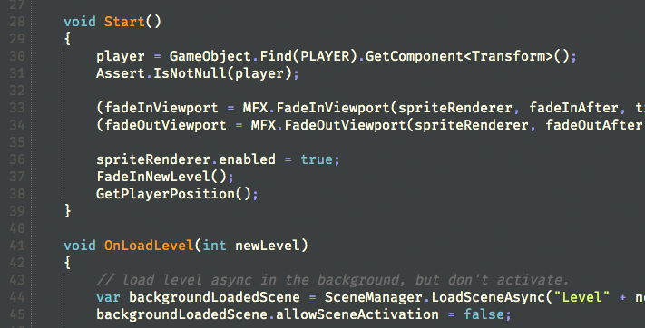

[![Platform][mlw-badge]][repo]&nbsp;
[![GitHub issues][issues-badge]][issues]&nbsp;
[![GitHub license][license-badge]][license]&nbsp;
[![Code of Conduct][coc-badge]][coc]&nbsp;

# Unity2D Components

This repository holds a varied collection of Unity3D components that I've built for use in the 2D Platformer/RPG I'm currently developing. The entire codebase is a work in progress, but please feel free to take a look around.

The components here are by no means an entire game—they're more like puzzle pieces that I'm constantly enhancing, reworking, and adding to. More documentation will come, *as time permits.*

## Installation

**Hey hey—no installation required!** This repo is probably most useful as a collection of C# scripts you can peruse for examples and usage ideas.

## Credit
Within the components included here you'll find reference to a number of great software packages, including the most excellent [CharacterController2D](https://github.com/prime31/CharacterController2D), the incredibly useful [Advanced C# Messenger](http://wiki.unity3d.com/index.php?title=Advanced_CSharp_Messenger), and perhaps my favorite Unity add-on of all, [DOTween](http://dotween.demigiant.com/). All of these packages have been instrumental in the development of my current project.

## Questions? Drop Us a Line!

### Contact
- Email: cary.a.miller@gmail.com
- Twitter: [@cmillerco](https://twitter.com/cmillerco)
- GitHub: [cmilr](https://github.com/cmilr/)

### License
Distributed under the MIT license. See ``LICENSE`` for more information.

# Thanks for using Unity2D Components!

<!--
Badge References
-->
[mlw-badge]:https://img.shields.io/badge/platform-macOS%20%7C%20Linux%20%7C%20Windows-8056d5.svg
[issues-badge]:https://img.shields.io/github/issues/cmilr/Unity2D-Components.svg
[license-badge]:https://img.shields.io/github/license/cmilr/Unity2D-Components.svg
[coc-badge]:https://img.shields.io/badge/code%20of-conduct-ff69b4.svg?style=flat

<!--
URL References
-->
[repo]:https://github.com/cmilr/Unity2D-Components
[issues]:https://github.com/cmilr/Unity2D-Components/issues
[license]:https://github.com/cmilr/Unity2D-Components/blob/master/LICENSE
[coc]:https://github.com/cmilr/Unity2D-Components/blob/master/CODE_OF_CONDUCT.md
